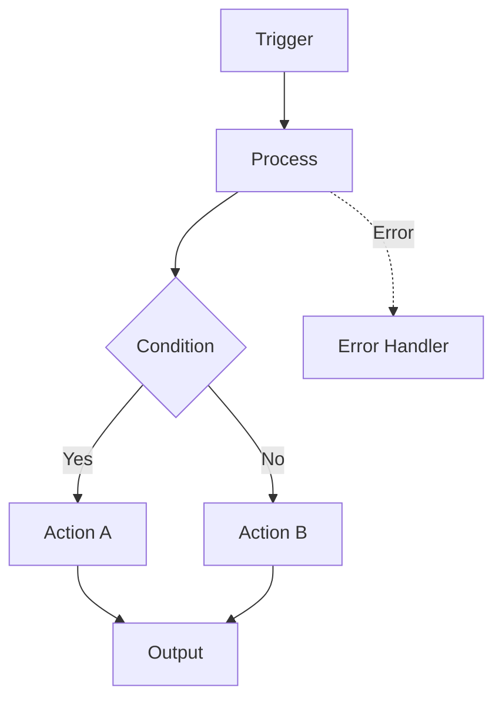

# n8n Workflow Development Runbook

The complete operational guide for developing n8n workflows with this toolkit.

---

## Quick Start (TL;DR)

```
1. /preflight          → Check all systems
2. /search-library     → Find existing solutions  
3. /new-workflow       → Start development
4. /validate           → Validate before deploy
5. /deploy             → Deploy to instance
```

---

## Part 1: Environment Setup

### Required MCP Servers
Ensure these are configured in your Claude Code settings:

| Server | Purpose | Required |
|--------|---------|----------|
| n8n-mcp | Workflow operations | ✅ Yes |
| context7 | Documentation | ✅ Yes |
| exa | Deep research | ✅ Yes |
| ref-tools | Doc search | ⚪ Recommended |
| playwright | Web automation | ⚪ Optional |
| memory | Knowledge graph | ⚪ Optional |

### Environment Variables
```bash
N8N_API_URL=https://your-n8n-instance.com
N8N_API_KEY=your-api-key-here
```

### Directory Structure Verification
```
n8n/
├── .claude/commands/     ✓ Slash commands
├── config/               ✓ MCP registry
├── context/              ✓ Cached docs & patterns
├── tools/                ✓ Search utilities
├── workflows/            ✓ Workflow storage
│   ├── dev/
│   ├── staging/
│   └── production/
├── CLAUDE.md             ✓ Master playbook
└── RUNBOOK.md            ✓ This file
```

---

## Part 2: Workflow Development Lifecycle

### Phase 1: Discovery (5-10 minutes)

**Goal**: Understand requirements and find existing solutions

#### Step 1.1: Parse Requirements
Extract from user request:
- [ ] What triggers the workflow? (webhook, schedule, manual, event)
- [ ] What data sources are involved?
- [ ] What transformations are needed?
- [ ] Where does output go?
- [ ] What happens on errors?

#### Step 1.2: Search Existing Solutions

**Search Order** (MANDATORY):

1. **Our Instance**
   ```
   mcp__n8n-mcp__n8n_list_workflows
   ```

2. **Community Library**
   ```
   WebFetch: https://zie619.github.io/n8n-workflows/api/workflows?q={keywords}
   ```

3. **MCP Templates**
   ```
   mcp__n8n-mcp__search_templates({query: "{keywords}"})
   ```

4. **Node-Specific Templates**
   ```
   mcp__n8n-mcp__list_node_templates({nodeTypes: ["n8n-nodes-base.{service}"]})
   ```

#### Step 1.3: Document Findings
Create a findings summary:
```markdown
## Search Results for: {requirement}

### Existing Solutions Found
- Instance: {count} similar workflows
- Community: {count} relevant workflows  
- Templates: {count} matching templates

### Recommendation
[ ] Adapt existing: {workflow name}
[ ] Build new: No suitable solution found

### Reusable Components
- Pattern from: {source}
- Node configs from: {source}
```

---

### Phase 2: Design (10-15 minutes)

**Goal**: Architecture the workflow before building

#### Step 2.1: Identify Nodes
```
mcp__n8n-mcp__search_nodes({query: "{capability}"})
```

For each required capability:
| Capability | Node Type | Version |
|------------|-----------|---------|
| Trigger | | |
| Data fetch | | |
| Transform | | |
| Output | | |
| Error handle | | |

#### Step 2.2: Get Node Configurations
```
mcp__n8n-mcp__get_node_essentials({nodeType: "nodes-base.{node}"})
```

⚠️ **ALWAYS use get_node_essentials first** (5KB vs 100KB)

#### Step 2.3: Design Flow Diagram


#### Step 2.4: Identify Credentials
| Service | Credential Type | Exists in Instance? |
|---------|-----------------|---------------------|
| | | |

---

### Phase 3: Build (Variable)

**Goal**: Construct the workflow JSON

#### Step 3.1: Start with Trigger
```json
{
  "id": "trigger-1",
  "name": "Descriptive Trigger Name",
  "type": "n8n-nodes-base.webhook",
  "typeVersion": 2,
  "position": [250, 300],
  "parameters": {
    // From get_node_essentials
  }
}
```

#### Step 3.2: Add Processing Nodes
For each node:
1. Get config: `get_node_essentials`
2. Configure parameters
3. Add error handling properties:
   ```json
   "onError": "continueErrorOutput",
   "retryOnFail": true,
   "maxTries": 3
   ```

#### Step 3.3: Build Connections
```json
"connections": {
  "Node A": {
    "main": [[{ "node": "Node B", "type": "main", "index": 0 }]]
  }
}
```

#### Step 3.4: Add Error Handler
Every production workflow needs:
```json
{
  "id": "error-handler",
  "name": "Error Handler",
  "type": "n8n-nodes-base.errorTrigger",
  "typeVersion": 1,
  "position": [250, 500]
}
```

---

### Phase 4: Validate (Required)

**Goal**: Ensure workflow is error-free

#### Step 4.1: Node Validation
For each node:
```
mcp__n8n-mcp__validate_node_operation({
  nodeType: "{type}",
  config: {parameters}
})
```

#### Step 4.2: Workflow Validation
```
mcp__n8n-mcp__validate_workflow({workflow: {...}})
```

#### Step 4.3: Connection Validation
```
mcp__n8n-mcp__validate_workflow_connections({workflow: {...}})
```

#### Step 4.4: Expression Validation
```
mcp__n8n-mcp__validate_workflow_expressions({workflow: {...}})
```

#### Step 4.5: Security Checklist
- [ ] No hardcoded API keys
- [ ] Credentials use n8n store
- [ ] No PII in node names
- [ ] Webhook paths are secure
- [ ] Sensitive data not logged

---

### Phase 5: Test (Required)

**Goal**: Verify workflow works correctly

#### Step 5.1: Save to Dev
Save workflow JSON to:
```
workflows/dev/{workflow-name}.json
```

#### Step 5.2: Deploy to Test Instance
```
mcp__n8n-mcp__n8n_create_workflow({...})
```

#### Step 5.3: Execute Test
- Manual trigger test
- Sample data test
- Error path test

#### Step 5.4: Verify Outputs
- Check expected results
- Verify error handling
- Confirm notifications work

---

### Phase 6: Deploy (Controlled)

**Goal**: Production deployment with safety

#### Step 6.1: Pre-Deploy Checklist
- [ ] All validations pass
- [ ] Tested in dev environment
- [ ] Stakeholder approval (if required)
- [ ] Backup plan ready

#### Step 6.2: Stage Workflow
```bash
cp workflows/dev/{name}.json workflows/staging/
git add workflows/staging/{name}.json
git commit -m "[n8n] stage: {name} - Ready for production"
```

#### Step 6.3: Production Deploy
```
mcp__n8n-mcp__n8n_create_workflow({
  name: "...",
  nodes: [...],
  connections: {...}
})
```

#### Step 6.4: Activate (Carefully)
- Confirm deployment successful
- Activate workflow
- Monitor initial executions

#### Step 6.5: Archive
```bash
cp workflows/staging/{name}.json workflows/production/
git add workflows/production/{name}.json
git commit -m "[n8n] deploy: {name} - Production release"
git tag -a "workflow-{name}-$(date +%Y%m%d)" -m "Production deployment"
```

---

## Part 3: Common Operations

### Adding New Integration

1. Check for existing node:
   ```
   mcp__n8n-mcp__search_nodes({query: "{service}"})
   ```

2. If no node, use HTTP Request with:
   ```
   /lookup-api {service}
   ```

3. Configure authentication:
   - OAuth2: Use n8n OAuth credentials
   - API Key: Use Header Auth credentials
   - Basic: Use Basic Auth credentials

### Updating Existing Workflow

1. Export current version:
   ```
   mcp__n8n-mcp__n8n_get_workflow({id: "..."})
   ```

2. Backup:
   ```bash
   cp workflows/production/{name}.json workflows/production/{name}.backup.json
   ```

3. Make changes and validate

4. Update via partial update (preferred):
   ```
   mcp__n8n-mcp__n8n_update_partial_workflow({
     id: "...",
     operations: [...]
   })
   ```

### Debugging Failed Workflow

1. Check execution logs:
   ```
   mcp__n8n-mcp__n8n_list_executions({workflowId: "...", status: "error"})
   ```

2. Get execution details:
   ```
   mcp__n8n-mcp__n8n_get_execution({id: "...", includeData: true})
   ```

3. Common issues:
   - Credential expired → Refresh OAuth
   - API rate limited → Add wait/retry
   - Data format changed → Update transformation

---

## Part 4: Troubleshooting

### n8n Instance Unreachable
```
Symptom: n8n_health_check fails
Fix: 
1. Check instance is running
2. Verify N8N_API_KEY is set
3. Check network connectivity
4. Test API endpoint directly
```

### Validation Errors
```
Symptom: validate_workflow returns errors
Fix:
1. Check specific error messages
2. Verify node type versions
3. Check connection indices
4. Validate expression syntax
```

### Workflow Not Triggering
```
Symptom: Workflow deployed but not executing
Fix:
1. Confirm workflow is active
2. Check trigger configuration
3. Verify webhook URL (if webhook)
4. Check schedule syntax (if scheduled)
```

---

## Part 5: Reference

### Node Type Prefixes
- `n8n-nodes-base.{name}` - Core nodes (436 nodes)
- `@n8n/n8n-nodes-langchain.{name}` - AI/LangChain nodes (92 nodes)

### Common Node Types
| Purpose | Node Type |
|---------|-----------|
| Webhook trigger | webhook |
| Schedule | scheduleTrigger |
| HTTP calls | httpRequest |
| Code | code |
| Conditionals | if, switch |
| Loops | splitInBatches |
| Errors | errorTrigger |

### Expression Syntax
```javascript
// Access current item
{{ $json.fieldName }}

// Access by node name
{{ $('Node Name').item.json.field }}

// Date/time
{{ $now.toISO() }}

// Conditional
{{ $json.status === 'active' ? 'Yes' : 'No' }}
```

---

*Last Updated: 2025-12-13*
*Version: 1.0.0*
